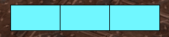
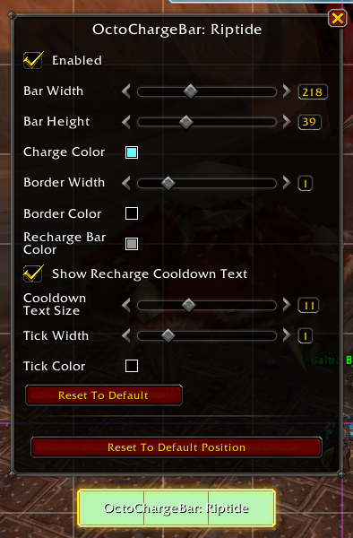

# OctoChargeBar
## What is this?
An addon to display charges of an important spell as a bar. Everything works in combat, but bars must be *initialized* out of combat in order to place tickmarks correctly.
### Example - Riptide

## Spells Currently Tracked
* Blood Death Knight
  * Blood Boil
  * Death and Decay
* Frost Death Knight
  * Empower Rune Weapon
* Balance Druid
  * Eclipse
    * Tracking Solar Eclipse (1233346) should also track Lunar Eclipse (1233272).
    * If this isn't the case let me know.
* Augmentation Evoker
  * Hover
  * Prescience
* Devastation Evoker
  * Hover
* Preservation Evoker
  * Reversion
  * Hover
* Beast Mastery Hunter
  * Kill Command
  * Barbed Shot
* Marksmanship Hunter
  * Aimed Shot
* Survival Hunter
  * Wildfire Bomb
* Arcane Mage
  * Arcane Orb
  * Shimmer
* Frost Mage
  * Flurry
  * Shimmer
* Fire Mage
  * Fire Blast
  * Shimmer
* Brewmaster Monk
  * Purifying Brew
  * Celestial Brew
  * Keg Smash
  * Roll
* Mistweaver Monk
  * Renewing Mists
  * Roll
* Windwalker Monk
  * Zenith
  * Roll
* Elemental Shaman
  * Lava Burst
* Restoration Shaman
  * Riptide
  * Lava Burst
* Destruction Warlock
  * Conflaguration
* Protection Warrior
  * Shield Block
## Configuration
All configuration happens in edit mode. Each bar for your spec will be enabled by default. You can turn off whatever you don't want and tweak whatever you do.

